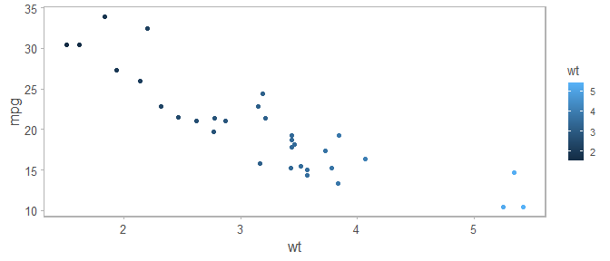

<!-- README.md is generated from README.Rmd. Please edit that file -->

# Package JTPfunc

A random collection of miscellaneous functions.

### Installation

You can install the development version of JTPfunc from
[GitHub](https://github.com/) with:

``` r
# install.packages("devtools")
devtools::install_github("justinpriest/JTPfunc")
```

## Example Functions

There are many unique functions contained here, many with esoteric
applications to ADF&G data.

### Function `statweek()`

To calculate the statistical week (Sunday-Saturday), use function
`statweek()` on a date object to return the stat week:

``` r
statweek(as.Date("2021-07-01"))
#> [1] 27
```

<hr>

<br>

### Function `theme_crisp()`

One applicable extension is a ggplot theme called with `theme_crisp()`:

``` r
library(JTPfunc)
library(ggplot2)
ggplot(mtcars, aes(x = wt, y = mpg, color = wt)) + geom_point() + theme_crisp()
```



<hr>

<br>

### Function `duplicaterows()`

For certain types of date (e.g., age summaries from the scale database)
the data are exported in an already summarized manner. That is, all fish
of the same date, species, sex, length, etc. are combined into a single
row.  
If we wish to run statistics on these data, it is helpful to have each
row be its own observation.  
Our example data look like:

``` r
coholengthdata 
#> # A tibble: 4 × 4
#>   Species Sex   Length Count
#>   <chr>   <chr>  <int> <int>
#> 1 Coho    M        621     1
#> 2 Coho    F        497     2
#> 3 Coho    M        557     3
#> 4 Coho    F        563     1
```

To add new rows to these data, we use function `duplicaterows()`,
specifying which row is the number of times to repeat. We can see that
the row with the two 497 mm female coho is repeated twice while the row
with three 557 mm male coho is repeated 3 times:

``` r
duplicaterows(dataframename = coholengthdata, 
              duplicatecolname = "Count")
#> # A tibble: 7 × 3
#>   Species Sex   Length
#>   <chr>   <chr>  <int>
#> 1 Coho    M        621
#> 2 Coho    F        497
#> 3 Coho    F        497
#> 4 Coho    M        557
#> 5 Coho    M        557
#> 6 Coho    M        557
#> 7 Coho    F        563
```

<hr>

<br>

### Function `count_pct()`

A common request is to determine the proportion of observations for each
group of data. Assuming that each row is an individual, we can calculate
a quick summary using `count_pct()` like so:

``` r
count_pct(iris %>%
           group_by(Species))
#> # A tibble: 3 × 3
#>   Species        n n_pct
#>   <fct>      <int> <dbl>
#> 1 setosa        50  33.3
#> 2 versicolor    50  33.3
#> 3 virginica     50  33.3
```

<hr>

<br>

### Function `addrowconditional()`

For the following example, we’ll use hypothetical rockfish catch data.  
In some historical datasets, catches were not identified to a specific
species but rather to species aggregates. For example, species code 168
refers to unspecified demersal shelf rockfishes while species code 140
is red rockfishes.

``` r
head(rockfishcatch)
#> # A tibble: 6 × 4
#>    Year Location Species Catch
#>   <int> <fct>      <int> <int>
#> 1  2010 Outer        140    12
#> 2  2010 Inner        140    33
#> 3  2010 Middle       140    19
#> 4  2010 Outer        168    33
#> 5  2010 Inner        168    27
#> 6  2010 Middle       168    24
```

For these data, the total catch of the species aggregates (species 140
and 168) was composed of several species. For this reason, these species
may require adding additional rows so that the total catch may be
apportioned. In our example, we repeat all rows of species 168 three
times, and repeat rows of species 140 two times, then sort by year and
species:

``` r
addrowconditional(rockfishcatch, criteriacolumn = Species,
                   repeatcount1 = 3, repeatcount2 = 2,
                   criteria1 = 168, criteria2 = 140,
                   sort1 = Year, sort2 = Species)
#> Joining with `by = join_by(Year, Location, Species, Catch)`
#> Joining with `by = join_by(Year, Location, Species, Catch)`
#> # A tibble: 33 × 4
#>     Year Location Species Catch
#>    <int> <fct>      <int> <int>
#>  1  2010 Outer        110    33
#>  2  2010 Inner        110    27
#>  3  2010 Middle       110    24
#>  4  2010 Outer        140    12
#>  5  2010 Inner        140    33
#>  6  2010 Middle       140    19
#>  7  2010 Outer        140    12
#>  8  2010 Inner        140    33
#>  9  2010 Middle       140    19
#> 10  2010 Outer        168    33
#> # ℹ 23 more rows
```

<hr>

<br>

### Function `impute_global()`

Dealing with missing data requires imputing the missing values based on
a relationship between known variables. The `impute_global` function
will create an imputed value for the use case of multiple rivers,
multiple years, and a single (escapement) count. Many biologists use an
Excel addin (“Missfill”) to impute across the river (columns) / year
(rows) matrix. This function works on “long” format data such as
downloaded from OceanAK and imputes across all available years/rivers.
This uses an iterative approach, following Blick. This function can be
easily modified to auto-create a named dataframe (argument
“outputname”). Make sure that all NAs are present (a missing row is NOT
same as a row with an NA).

For example, consider this dataset of 3 streams and 4 years, containing
2 NAs.

``` r
streamcounts 
#> # A tibble: 12 × 3
#>     Year Stream             Count
#>    <int> <chr>              <int>
#>  1  2022 Berners River         NA
#>  2  2023 Berners River        200
#>  3  2024 Berners River        150
#>  4  2025 Berners River        300
#>  5  2022 Niukluk River       1000
#>  6  2023 Niukluk River        900
#>  7  2024 Niukluk River        800
#>  8  2025 Niukluk River       1200
#>  9  2022 Resurrection Creek   150
#> 10  2023 Resurrection Creek    NA
#> 11  2024 Resurrection Creek   140
#> 12  2025 Resurrection Creek   300
```

To impute the missing values, we run `impute_global()`:

``` r
impute_global(streamcounts, Year_column = "Year", StreamName_column = "Stream",
              count_column = "Count")
#> # A tibble: 12 × 4
#>     year stream_name        total_count imputed
#>    <int> <chr>                    <dbl> <lgl>  
#>  1  2022 Berners River             213. TRUE   
#>  2  2023 Berners River             200  FALSE  
#>  3  2024 Berners River             150  FALSE  
#>  4  2025 Berners River             300  FALSE  
#>  5  2022 Niukluk River            1000  FALSE  
#>  6  2023 Niukluk River             900  FALSE  
#>  7  2024 Niukluk River             800  FALSE  
#>  8  2025 Niukluk River            1200  FALSE  
#>  9  2022 Resurrection Creek        150  FALSE  
#> 10  2023 Resurrection Creek        177. TRUE   
#> 11  2024 Resurrection Creek        140  FALSE  
#> 12  2025 Resurrection Creek        300  FALSE
```

There are actually several impute functions in this package, each
imputing for specific use cases:  
`impute_global()`: Impute all available data and years.  
`impute_local()`: 10-yr Localized Imputation. This takes a dataframe
with NA values and imputes missing data. This algorithm uses “local”
imputation: only 5 years before and after impute a missing value, i.e.,
only using the preceding 5 years and following 5 years.  
`impute_local_improved()`: 10-yr Localized Imputation, improved. This
algorithm uses the `impute_local()` implementation, however it adds a
rule for the first 10 years to use the 10 next years (10-year
minimum).  
`impute_cohodefault()`: Specific to the SEAK Coho Research program, this
imputes 1987-2000 first, then each year is imputed after that, building
on itself (i.e., imputed values from 2001 inform the imputation in
2002).
